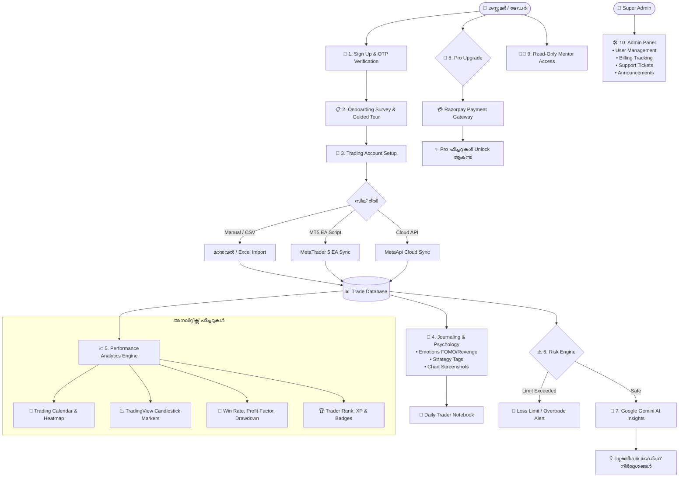
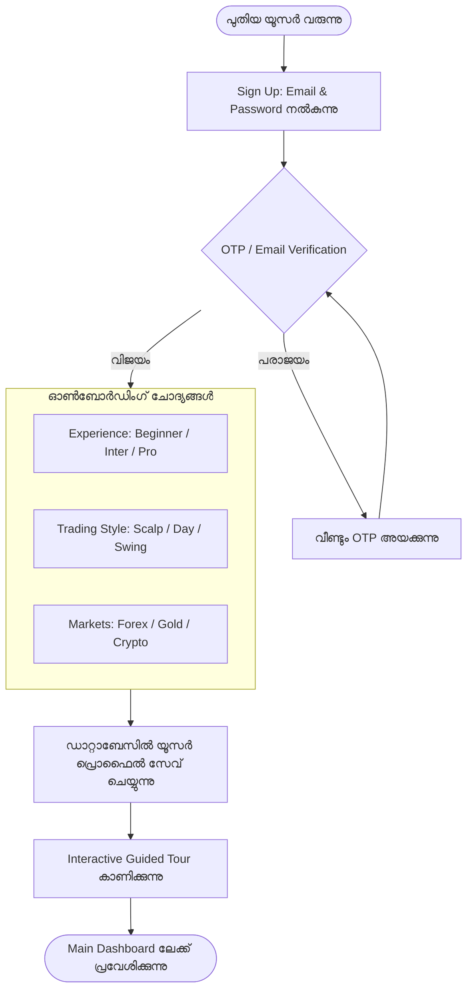
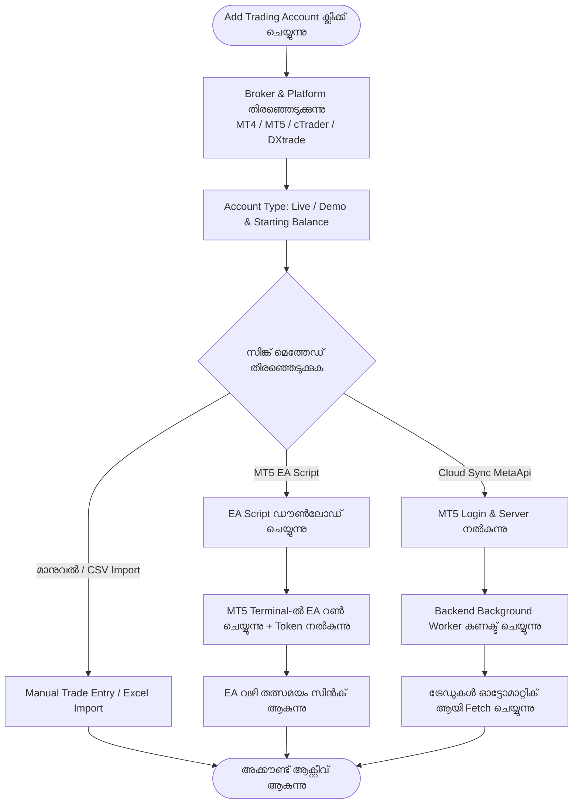
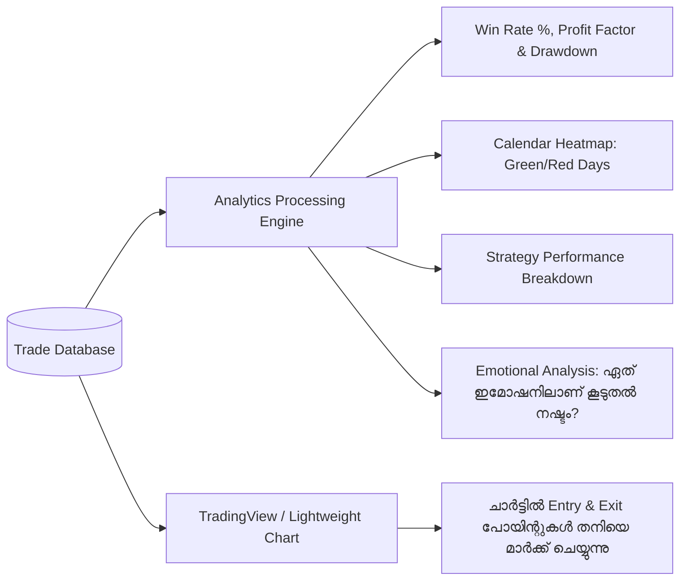
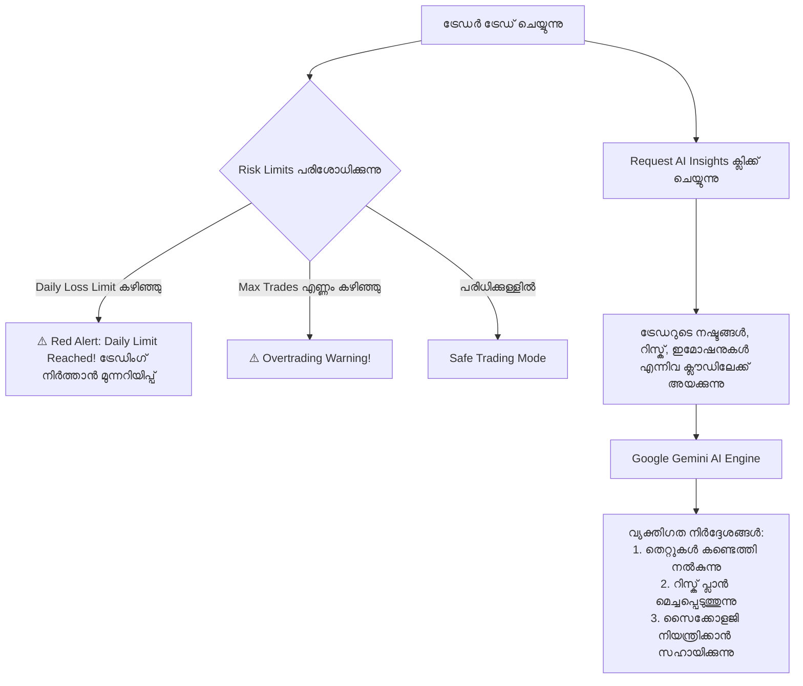
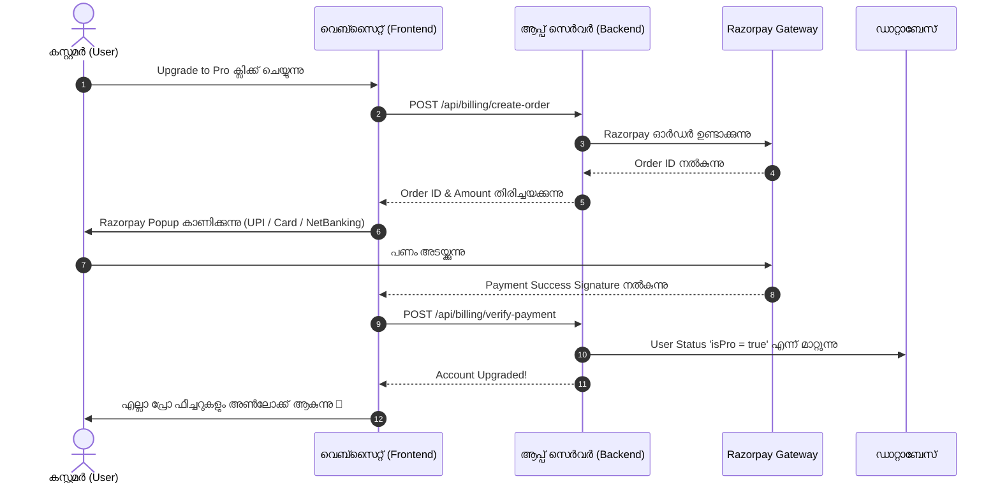
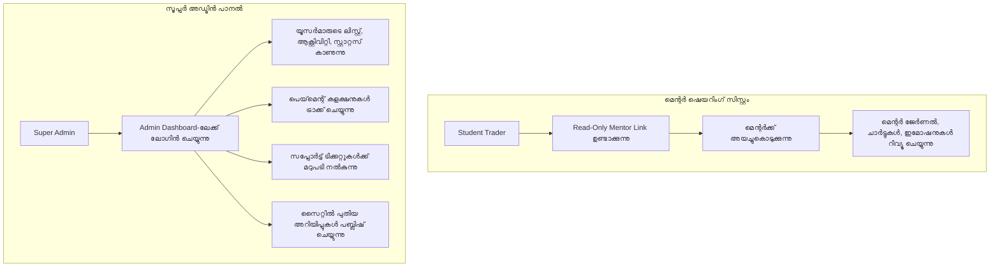

# 📘 AxyFx Journal Pro – സമ്പൂർണ്ണ സിസ്റ്റം & കസ്റ്റമർ വർക്ക്ഫ്ലോ ഗൈഡ് (Master Workflow Documentation)

---

## 🌟 1. ആകെ സിസ്റ്റത്തിന്റെ സമഗ്രമായ മാസ്റ്റർ ഡയഗ്രം (All-in-One Master Workflow)

മുഴുവൻ സിസ്റ്റവും എങ്ങനെ ഒരൊറ്റ കുടക്കീഴിൽ പ്രവർത്തിക്കുന്നുവെന്ന് താഴെ കാണുന്ന മാസ്റ്റർ ഫ്ലോചാർട്ടിലൂടെ മനസ്സിലാക്കാം:



---

## 🔄 2. ഓരോ ഘട്ടത്തിന്റെയും പ്രത്യേക ഡയഗ്രമുകൾ (Detailed Module Diagrams)

---

### ഘട്ടം 1: രജിസ്ട്രേഷനും ഓൺബോർഡിംഗും (Authentication & Onboarding)
കസ്റ്റമർ വെബ്‌സൈറ്റിൽ രജിസ്റ്റർ ചെയ്ത് ഡാഷ്‌ബോർഡിലേക്ക് പ്രവേശിക്കുന്ന പ്രക്രിയ:



---

### ഘട്ടം 2: ട്രേഡിംഗ് അക്കൗണ്ട് സെറ്റപ്പും MT5 ഓട്ടോ-സിങ്കും (Account Connectivity)
കസ്റ്റമറുടെ MT4/MT5 ബ്രോക്കർ അക്കൗണ്ടുകൾ സിസ്റ്റവുമായി ബന്ധിപ്പിക്കുന്നത്:



---

### ഘട്ടം 3: ട്രേഡ് ലോഗിംഗും സൈക്കോളജി ജേർണലിംഗും (Trade Logging & Emotions)
ട്രേഡ് വിവരങ്ങളും മാനസികാവസ്ഥയും രേഖപ്പെടുത്തുന്ന രീതി:

```mermaid
flowchart TD
    NewTrade([ട്രേഡ് ലോഗ് ചെയ്യുന്നു]) --> Inputs[വിവരങ്ങൾ നൽകുന്നു:<br/>Symbol, Buy/Sell, Lots, Entry, Exit, SL, TP]
    Inputs --> AutoCalc[സിസ്റ്റം തനിയെ ലാഭനഷ്ടം (PnL), RRR,<br/>Pip Value എന്നിവ കണക്കുകൂട്ടുന്നു]
    
    AutoCalc --> PsychInfo[സൈക്കോളജി വിവരങ്ങൾ ചേർക്കുന്നു]
    subgraph PsychInfo [Emotion & Strategy]
        Emo[Emotion: Calm / FOMO / Greed / Revenge]
        Strat[Strategy: Breakout / Pullback / ICT etc.]
        Notes[Notes & Trade Screenshots അപ്‌ലോഡ് ചെയ്യുന്നു]
    end
    
    PsychInfo --> SaveTrade[ഡാറ്റാബേസിൽ ട്രേഡ് സേവ് ആകുന്നു]
    SaveTrade --> UpdateStats[Dashboard & Calendar തത്സമയം അപ്‌ഡേറ്റ് ആകുന്നു]
    UpdateStats --> XPBadge[Trader XP & Streaks അപ്‌ഡേറ്റ് ആകുന്നു]
```

---

### ഘട്ടം 4: പെർഫോമൻസ് അനലിറ്റിക്സും ചാർട്ടിംഗും (Analytics & Live Charts)
ട്രേഡറുടെ പെർഫോമൻസ് സിസ്റ്റം അനലൈസ് ചെയ്യുന്ന രീതി:



---

### ഘട്ടം 5: AI ഇൻസൈറ്റുകളും റിസ്ക് ഗാർഡ്‌റെയിൽസും (AI Insights & Risk Management)
AI ഉപദേശങ്ങളും, അക്കൗണ്ട് സംരക്ഷിക്കാനുള്ള റിസ്ക് മാനേജ്‌മെന്റും:



---

### ഘട്ടം 6: പ്രോ സബ്സ്ക്രിപ്ഷനും പെയ്‌മെന്റും (Pro Upgrade & Payments)
കസ്റ്റമർ പ്രോ പ്ലാൻ എടുക്കുന്ന പ്രക്രിയ:



---

### ഘട്ടം 7: മെന്റർ ഷെയറിംഗും സൂപ്പർ അഡ്മിൻ പാനലും (Mentorship & Admin Management)



---

## 📋 സംഗ്രഹം (Summary)
ഈ പ്ലാറ്റ്‌ഫോം ഒരു സാധാരണ ജേർണലിനേക്കാൾ ഉപരിയായി, ഒരു ട്രേഡറുടെ പൂർണ്ണ വളർച്ചയ്ക്കും അച്ചടക്കത്തിനും (Discipline) വേണ്ടി രൂപകൽപ്പന ചെയ്തിട്ടുള്ള സമ്പൂർണ്ണ ട്രേഡിംഗ് ഇക്കോസിസ്റ്റമാണ്.
